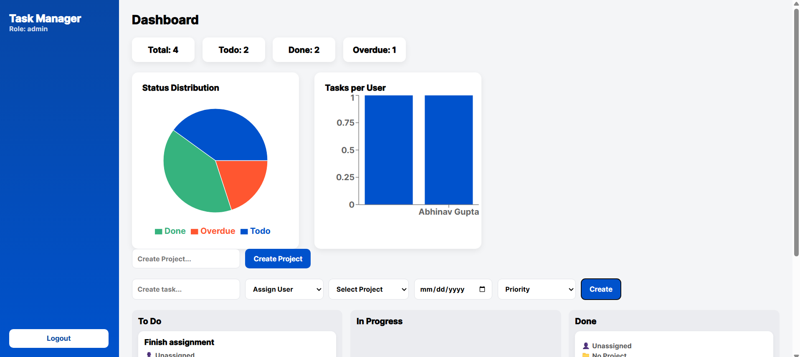

#  Task Manager

## 🌐 Live Demo
🔹 Frontend: https://task-manager-lac-iota.vercel.app/
🔹 Backend API: https://task-manager-production-fb7d.up.railway.app/

## 🖥️ Dashboard Preview


---

## 📌 About Project

A full-stack web application to manage tasks in a team environment.
Built with **React, Node.js, Express, MongoDB (MERN stack)**.

---

## 📌 Features

### 🔐 Authentication

* Signup & Login using JWT
* Secure user sessions

### 👥 Role-Based Access

* **Admin**

  * Create projects
  * Assign tasks
  * Manage users
* **Member**

  * View assigned tasks
  * Update task status

### 📂 Project Management

* Create projects
* Add members
* Assign tasks

### 📝 Task Management

* Create tasks with:

  * Title
  * Due Date
  * Priority (Low / Medium / High)
* Track progress

### 📊 Dashboard

* Total tasks
* Tasks by status
* Tasks per user
* Overdue tasks

---

## ⚙️ Tech Stack

* Frontend: React.js
* Backend: Node.js, Express.js
* Database: MongoDB
* Auth: JWT

---

## 🚀 Installation

```bash
git clone https://github.com/anudita003/task-manager.git
cd task-manager
```

### Client

```bash
cd client
npm install
npm start
```

### Server

```bash
cd server
npm install
npm run dev
```

---

## 🌐 Environment Variables

```env
MONGO_URI=your_mongodb_url
JWT_SECRET=your_secret_key
PORT=5000
```

---

## 📌 Author

**Anudita**
https://github.com/anudita003

