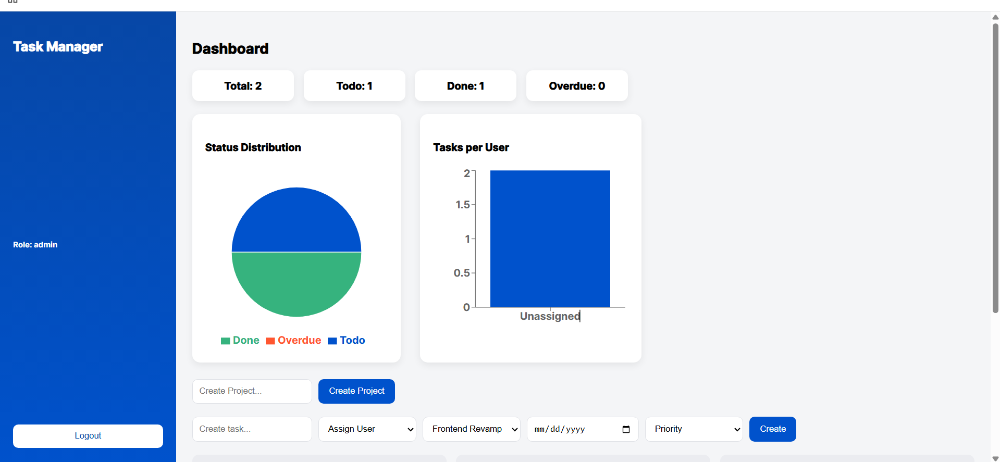

#  MERN Task Manager

A full-stack **Task Management Web Application** built using the MERN stack (MongoDB, Express, React, Node.js).
It supports **role-based access (Admin/User)**, project management, task assignment, and analytics dashboard.

---

##  Dashboard Preview



---

## ✨ Features

* 🔐 JWT Authentication (Login / Signup)
* 👥 Role-based access (Admin & Member)
* 📁 Project Management
* ✅ Task Assignment to Users
* 📅 Due Date & Priority Tracking
* 📊 Dashboard with Charts (Task Stats)
* 🧑‍🤝‍🧑 User-wise Task Distribution
* 🗂️ Kanban Board (Todo → In Progress → Done)

---

## 🛠️ Tech Stack

**Frontend**

* React.js
* CSS

**Backend**

* Node.js
* Express.js

**Database**

* MongoDB (Mongoose)

**Authentication**

* JWT (JSON Web Token)

---

## ⚙️ Installation & Setup

### 1️⃣ Clone Repository

```bash
git clone https://github.com/your-username/task-manager.git
cd task-manager
```

---

### 2️⃣ Backend Setup

```bash
cd server
npm install
```

Create `.env` file inside `server`:

```env
MONGO_URI=your_mongodb_connection_string
JWT_SECRET=your_secret_key
PORT=5000
```

Run backend:

```bash
npm start
```

---

### 3️⃣ Frontend Setup

```bash
cd client
npm install
npm start
```

---

## 🔑 Admin Access

You can make any user admin from backend:

```
/api/auth/make-admin/:email
```

---

## 📊 Future Improvements

* Drag & Drop tasks
* Notifications
* Real-time updates
* Team chat system

---

## 🙌 Author

**Anudita Nigam**

---

## ⭐ Show Your Support

If you like this project, give it a ⭐ on GitHub!
